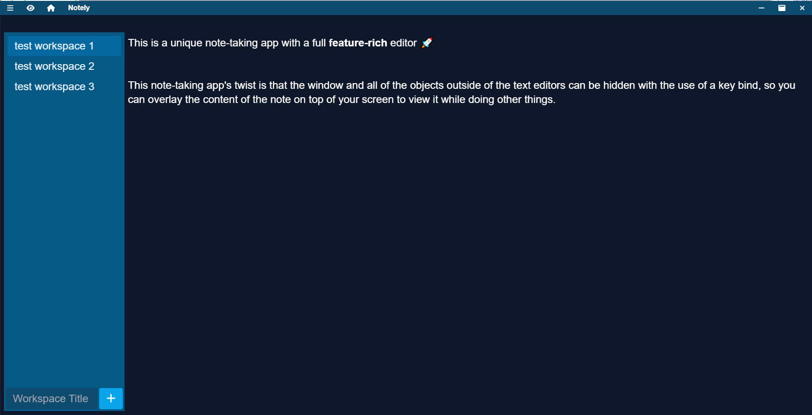
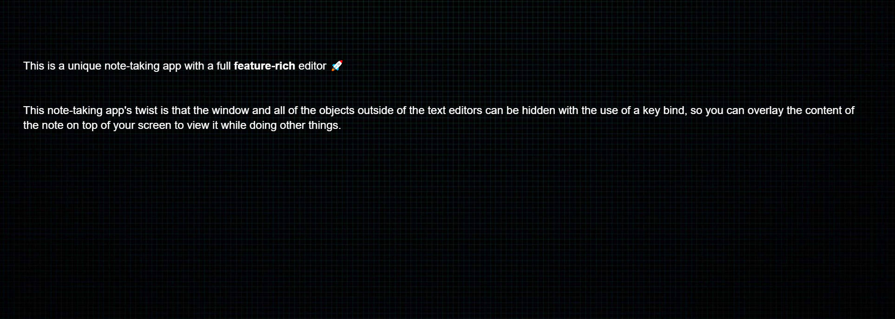

# A note-taking app with a unique twist

This note taking app allows you to use notes as an overlay on top of your screen. Take notes in the editor, then use the keybind or eye button to hide the entire window, leaving only the contents on the editor visible.

> Electron with TypeScript, NextJS, and Tailwind

Example before and after images:



Content behind the overlay is fully- with no interference from the editor itself (besides the keybind which is ctrl+i).

```bash
"build-renderer": build and transpile Next.js layer
"build-electron": transpile electron layer
"build": build both layers
"dev": start dev version
"dist": create production electron build
"type-check": check TypeScript in project
```

## Notes

You can create the production app using `npm run dist`.
